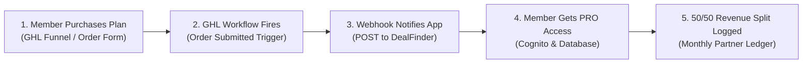

# 🚀 Agency Owner Guide: Automated Member Onboarding & Subscription Sync

This guide provides step-by-step instructions for the **Agency Owner** to automate member onboarding, subscription management, and app access for **DealFinder / AI Outreach**.

---

## 📋 Overview of the Flow



---

## 🛠️ Implementation Checklist (5 Steps)

### Step 1: Obtain Your Webhook Credentials
- **Webhook Endpoint URL**: `https://dealfinder.yourailaunch.com/api/v1/ghl/subscription-webhook?secret=YOUR_SHARED_SECRET`
- **HTTP Method**: `POST`
- **Header**: `Content-Type: application/json`

---

### Step 2: Create Workflow 1 — "Member Subscription Activated"
In your HighLevel account (where the sales funnel/order form lives):

1. Go to **Automation** $\rightarrow$ **Workflows** $\rightarrow$ **Create Workflow** (Start from Scratch).
2. Name the workflow: `DealFinder - Subscription Activated`.
3. **Set the Trigger**:
   - Trigger: **Order Submitted** (or **Payment Received**)
   - Filters:
     - *In Funnel*: Select your DealFinder SaaS / Membership Funnel
     - *Submission Type*: `Sale`
4. **Add Action: Webhook (POST)**:
   - Action Type: **Custom Webhook** (POST)
   - URL: `https://dealfinder.yourailaunch.com/api/v1/ghl/subscription-webhook?secret=YOUR_SHARED_SECRET`
   - Method: `POST`
   - Select **Custom Data** (or Send All Data):
     ```json
     {
       "email": "{{contact.email}}",
       "firstName": "{{contact.first_name}}",
       "lastName": "{{contact.last_name}}",
       "locationId": "{{location.id}}",
       "plan": "PRO",
       "amount": 97,
       "status": "active"
     }
     ```
     *(Note: Change `"plan"` to `"AI_PLAN"` or `"amount"` to match your pricing tier, e.g., $97/mo, $197/mo).*

5. **Add Action: Send Welcome Email**:
   - Subject: `Welcome to DealFinder — Access Your Account`
   - Body:
     > *"Hi {{contact.first_name}},*
     >
     > *Thank you for subscribing! Your DealFinder Pro account is now active.*
     >
     > *1. Log in to your DealFinder portal: https://dealfinder.yourailaunch.com/login using your email ({{contact.email}}).*
     > *2. Inside your dashboard, click **Connect HighLevel** to link your sub-account.*
     >
     > *If you have any questions, reply to this email!"*

6. **Publish** the workflow.

---

### Step 3: Create Workflow 2 — "Subscription Canceled / Payment Failed"
To ensure members who cancel or fail payments are automatically downgraded:

1. Create a new Workflow named: `DealFinder - Subscription Canceled`.
2. **Set the Trigger**:
   - Trigger: **Subscription Status Changed** (or **Payment Failed** / **Tag Added: Canceled**)
   - Filters:
     - *Status*: `Canceled` or `Past Due` or `Unpaid`
3. **Add Action: Webhook (POST)**:
   - URL: `https://dealfinder.yourailaunch.com/api/v1/ghl/subscription-webhook?secret=YOUR_SHARED_SECRET`
   - Method: `POST`
   - Custom Data:
     ```json
     {
       "email": "{{contact.email}}",
       "locationId": "{{location.id}}",
       "status": "cancelled"
     }
     ```
4. **Publish** the workflow.

---

### Step 4: Sub-Account Marketplace App Connection
When onboarding the member into their sub-account:
1. Ensure the member's sub-account has **LC Phone** or Twilio enabled (for call & SMS features).
2. The member logs in to **DealFinder** (`https://dealfinder.yourailaunch.com/login`) and clicks **Connect HighLevel**.
3. They authorize their assigned sub-account. DealFinder will **automatically provision all custom fields, pipeline stages, and tags** into their sub-account.

---

### Step 5: Test & Verify
1. Run a test transaction in test mode through your GHL funnel.
2. Verify the webhook execution log inside GHL (**Execution Logs** tab).
3. Confirm the member account is active in DealFinder with `PRO` access.

---

## 💰 50/50 Revenue Share & Settlement Options

- **Real-Time Tracking**: Every active member who purchases through your funnel is registered in the shared billing ledger.
- **50% Payout Formula**:
  $$\text{Total Monthly Payout to App Owner} = (\text{Total Active PRO Members} \times \text{Plan Price}) \times 50\%$$
- **Cancellations / Downgrades**: Automatically deducted from the active tally so you only split revenue for active, paying members.

### Payout Methods (Choose One)

#### Option A: Manual Monthly Settlement (Standard & Easiest to Start)
1. **Agency Collects 100%**: The agency collects the full subscription payments from members into their Stripe / GHL account.
2. **Monthly Statement**: On the 1st of each month, the app generates a simple settlement statement showing total active members and the 50% split.
3. **Payout Transfer**: The agency owner transfers the 50% payout to the app owner via:
   - **Direct ACH / Bank Transfer / Wire**
   - **Stripe Invoicing** (app owner sends a one-click invoice to the agency)
   - **Zelle / Wise / Business Venmo**

#### Option B: Automated Real-Time Split (Stripe Connect)
1. **Point-of-Sale Split**: If using Stripe for your agency funnels, the app owner connects a Stripe Connect account.
2. **Instant Routing**: Whenever a member pays (e.g. $97/mo):
   - **$48.50 (50%)** deposits directly into the **Agency Owner's** bank account.
   - **$48.50 (50%)** deposits directly into the **App Owner's** bank account.
3. **Zero Manual Work**: No monthly invoices or manual transfers needed.

---

### 📞 Support & Contacts
If you need any adjustments or test verification, contact **Jose Fernandez**.
